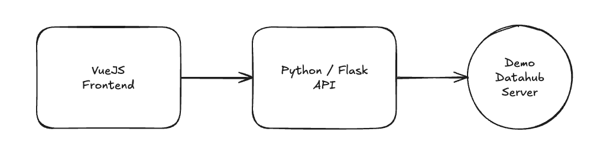
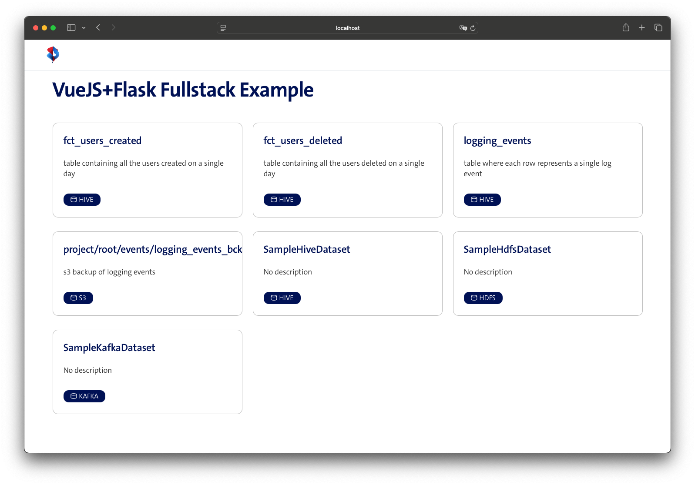

# Team ATLAS Coding Challenge 

Welcome to the ATLAS team coding challenge!

> [!IMPORTANT]  
> Before you start:
Please don't fork this repository, as it will be visible to other candidates. Instead, clone it and push it to your own repository.
We will not need access to your repository - you can present your solution during the interview.

## About

In this repo you will find a coding challenge for the ATLAS team. The goal is to test your skills in the following areas:

- VueJS
- Python
- Docker
- REST APIs

Your task is to build a containerised application that fetches data from an upstream API and displays it in a UI. 
We've provided skeleton code for both the frontend and the backend, but feel free to modify it as you see fit.

- The folder `flask-backend` contains the skeleton code for the API. See api.py for additional pointers.
- The folder `vue-frontend` contains the skeleton code for the UI. See App.vue for additional pointers.

## Why this challenge? And why these technologies in particular?

Our team operates a [Datahub](https://datahubproject.io/) instance within Swisscom, so the upstream API is a demo version of this.
We need to integrate with this platform, and their main SDK is written in Python.
We use VueJS for our frontend applications, and run our workloads in containers so we'd like to see how you work with these technologies.

## Example output of the final solution

> [!TIP]
> Your solution does not need to implement the Swisscom style guide, but we've linked it in the App.vue file for reference.

## Deliverables

A containerised application that you can run during the interview. Docker / Compose / k3s / minikube are all acceptable ways to run the application.

## Last but not least

- Feel free to also explore the UI of Datahub to get a better understanding of the data you are fetching. https://datahub.richert.li/ - login demo:demo
- We don't expect candidates to be experts in all topics listed here. We are looking for a good understanding of the technologies and a willingness to learn. 
- Focus on the things you know and add personal preferences to the solution. We are looking forward to seeing your creativity.